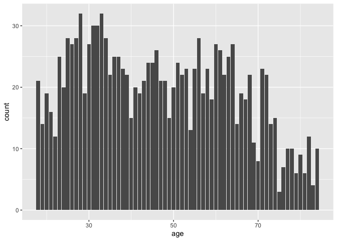

Lab 06 - Ugly charts and Simpson’s paradox
================
Rowan Kemmerly
4/27/23

### Load packages and data

``` r
library(tidyverse) 
library(dsbox)
library(mosaicData) 
```

``` r
staff <- read_csv("data/instructional-staff.csv")
```

    ## Rows: 5 Columns: 12
    ## ── Column specification ────────────────────────────────────────────────────────
    ## Delimiter: ","
    ## chr  (1): faculty_type
    ## dbl (11): 1975, 1989, 1993, 1995, 1999, 2001, 2003, 2005, 2007, 2009, 2011
    ## 
    ## ℹ Use `spec()` to retrieve the full column specification for this data.
    ## ℹ Specify the column types or set `show_col_types = FALSE` to quiet this message.

``` r
staff_long <- staff %>%
  pivot_longer(cols = -faculty_type, names_to = "year") %>%
  mutate(value = as.numeric(value))

staff_long
```

    ## # A tibble: 55 × 3
    ##    faculty_type              year  value
    ##    <chr>                     <chr> <dbl>
    ##  1 Full-Time Tenured Faculty 1975   29  
    ##  2 Full-Time Tenured Faculty 1989   27.6
    ##  3 Full-Time Tenured Faculty 1993   25  
    ##  4 Full-Time Tenured Faculty 1995   24.8
    ##  5 Full-Time Tenured Faculty 1999   21.8
    ##  6 Full-Time Tenured Faculty 2001   20.3
    ##  7 Full-Time Tenured Faculty 2003   19.3
    ##  8 Full-Time Tenured Faculty 2005   17.8
    ##  9 Full-Time Tenured Faculty 2007   17.2
    ## 10 Full-Time Tenured Faculty 2009   16.8
    ## # … with 45 more rows

### Exercise 1

``` r
staff_long %>%
  ggplot(aes(x = year, y = value, color = faculty_type)) +
  geom_line()
```

    ## `geom_line()`: Each group consists of only one observation.
    ## ℹ Do you need to adjust the group aesthetic?

<!-- -->

``` r
staff_long %>%
  ggplot(aes(x = year,
             y = value,
             group = faculty_type,
             color = faculty_type)) +
  geom_line() + 
  labs(title = "Instructional staff employement trends", color = "Faculty Type", x = "Year", y = "Number of employees")
```

<!-- -->

### Exercise 2

I would create new variables for each of the instructional staff types
that represented the proportion of each type out of all of the types
combined, and graph that in the same way I did above (year by
proportion)

### Exercise 3

Here are my first thoughts on what I think they should change: 1. I
think they really need to change the scale and/or cut out even more of
the lesser-producing countries.(Is the x axis on the left not even
showing all of the country names?) 2. What to the red and blue mean on
the figure on the left? I guess it must be capture vs. aquaculutre, but
this isn’t clear at first because it’s not labeled. 3. I don’t really
think the pie charts on the right are necessary.

``` r
fisheries <- read_csv("data/fisheries.csv")
```

    ## Rows: 216 Columns: 4
    ## ── Column specification ────────────────────────────────────────────────────────
    ## Delimiter: ","
    ## chr (1): country
    ## dbl (3): capture, aquaculture, total
    ## 
    ## ℹ Use `spec()` to retrieve the full column specification for this data.
    ## ℹ Specify the column types or set `show_col_types = FALSE` to quiet this message.

``` r
library(ggplot2)

# only keep countries with over 3 million fish captured or farmed in total
fisheries_over3mil <- fisheries %>% 
  filter(total > 3000000)


# make "country" variable a factor

fisheries_over3mil$country <- as_factor(fisheries_over3mil$country)

#reorder (descending total harvest)

fisheries_over3mil <- fisheries_over3mil %>% 
  mutate(country = fct_reorder(country, -total))

# plot the data


# ggplot(fisheries_over3mil, aes(x= country)) +
#   geom_area(aes(fill = "captured", y = capture), alpha = 0.5) +
#   geom_area(aes(fill = "farmed", y = aquaculture), alpha = 0.5) +
#   scale_fill_manual(values = c("captured" = "#43a2ca", "farmed" = "#a8ddb5")) +
#   labs(title = "Total fish harvest by country", subtitle = "for countries with the top 13 fishing industries in the world", fill = "Captured vs. farmed", x = "Country", y = "Number of fish captured or farmed") +
#   theme_classic()

# I realized that geom_area doesn't work with one continuous variable/one discrete variable in ggplot...so trying other plots!

# ggplot(fisheries_over3mil, aes(x= country)) +
#   geom_point(aes(color = "captured", y = capture), alpha = 0.5) +
#   geom_point(aes(color = "farmed", y = aquaculture), alpha = 0.5) +
#   scale_color_manual(values = c("captured" = "#43a2ca", "farmed" = "#a8ddb5")) +
#   labs(title = "Total fish harvest by country", subtitle = "for countries with the top 13 fishing industries in the world", color = "Captured vs. farmed", x = "Country", y = "Number of fish captured or farmed") +
#   theme_classic() 


ggplot(fisheries_over3mil, aes(x= country)) +
  geom_col(aes(fill = "captured", y = capture), alpha = 0.5) +
  geom_col(aes(fill = "farmed", y = aquaculture), alpha = 0.5) +
  scale_fill_manual(values = c("captured" = "#43a2ca", "farmed" = "#a8ddb5")) +
  labs(title = "Total fish harvest by country", subtitle = "for countries with the top 13 fishing industries in the world", fill = "Captured vs. farmed", x = "Country", y = "Number of fish captured or farmed") +
  theme_classic() 
```

<!-- -->

I’m going to do another plot without China and indonesia so the scale
isn’t so wonky still.

``` r
fisheries_over3mil_nochina <- fisheries_over3mil %>%
  filter (total < 20000000)

ggplot(fisheries_over3mil_nochina, aes(x= country)) +
  geom_col(aes(fill = "captured", y = capture), alpha = 0.5) +
  geom_col(aes(fill = "farmed", y = aquaculture), alpha = 0.5) +
  scale_fill_manual(values = c("captured" = "#43a2ca", "farmed" = "#a8ddb5")) +
  labs(title = "Total fish harvest by country", subtitle = "for countries with the top 11 fishing industries in the world (excluding China and Indonesia)", fill = "Captured vs. farmed", x = "Country", y = "Number of fish captured or farmed") +
  theme_classic() 
```

<!-- -->

I like the low alpha/stacked bar chart look because you can tell based
on whether the bar looks more green or blue whether the country does
more farming vs. capturing.

## Stretch Practice with Smokers in Whickham

``` r
data(Whickham)

# ?Whickham
# library(performance)
# performance::compare_performance()
```

### Exercise 1 (Smokers)

Observational, because you can’t force people to be smokers for an
experiment.

### Exercise 2 (Smokers)

1314 observations, each representing a woman from Whickham.

### Exercise 3 (Smokers)

3 variables: outcome (dead or alive; discrete), smoker (yes or no;
discrete), and age (continuous)

They’re all integers in the data set:

``` r
typeof(Whickham$outcome)
```

    ## [1] "integer"

``` r
typeof(Whickham$smoker)
```

    ## [1] "integer"

``` r
typeof(Whickham$age)
```

    ## [1] "integer"

``` r
Whickham %>%
ggplot(aes(x = outcome)) +
  geom_bar()
```

<!-- -->

``` r
Whickham %>%
ggplot(aes(x = smoker)) +
  geom_bar()
```

<!-- -->

``` r
Whickham %>%
ggplot(aes(x = age)) +
  geom_bar()
```

<!-- -->

### Exercise 4 (Smokers)

I’d expect more smokers to be dead than non-smokers, controlling for
age.

### Exercise 5 (Smokers)

``` r
Whickham %>%
  count(smoker, outcome)
```

    ##   smoker outcome   n
    ## 1     No   Alive 502
    ## 2     No    Dead 230
    ## 3    Yes   Alive 443
    ## 4    Yes    Dead 139

``` r
ggplot(Whickham, aes(x=smoker, fill=outcome))+
  geom_bar()+
  labs(title = "Health outcomes of smokers vs. non-smokers In Whickham, UK",
       x="smoker?",
       y="number of individuals")
```

<!-- --> So, this
shows that more non-smokers (31.4%) are dead than smokers (23.9%). I’m
almost certain that this is just because we didn’t factor in age at time
of study.

### Exercise 6 (Smokers)

``` r
Whickham <- Whickham %>%
  mutate(age_cat = case_when(age <= 44 ~ "18-44",
                             age > 44 & age <= 64 ~ "45-64",
                             age > 64 ~ "65+"))
```

### Exercise 7 (Smokers)

``` r
Whickham %>%
  count(smoker, age_cat, outcome)
```

    ##    smoker age_cat outcome   n
    ## 1      No   18-44   Alive 327
    ## 2      No   18-44    Dead  12
    ## 3      No   45-64   Alive 147
    ## 4      No   45-64    Dead  53
    ## 5      No     65+   Alive  28
    ## 6      No     65+    Dead 165
    ## 7     Yes   18-44   Alive 270
    ## 8     Yes   18-44    Dead  15
    ## 9     Yes   45-64   Alive 167
    ## 10    Yes   45-64    Dead  80
    ## 11    Yes     65+   Alive   6
    ## 12    Yes     65+    Dead  44

``` r
ggplot(Whickham, aes(x=smoker, fill=outcome))+
  geom_bar()+
  labs(title = "Health outcomes of smokers vs. non-smokers In Whickham, UK",
       x="smoker?",
       y="number of individuals") + 
  facet_wrap (~age_cat)
```

<!-- -->

Now that we’ve added age everything makes sense. Young people are still
alive almost no matter what, and for older individuals a larger
proportion of smokers vs. non-smokers have died.
